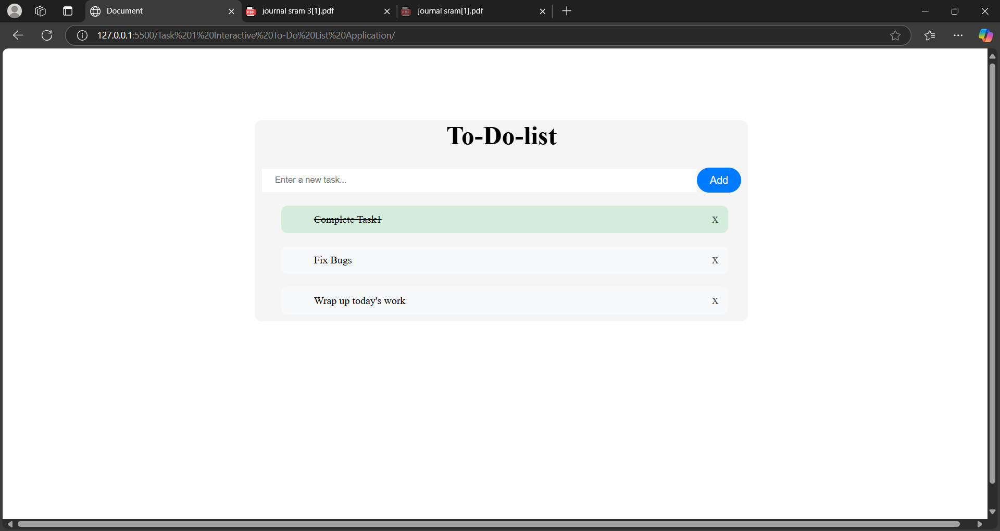

# Task 1: Interactive To-Do List Application

## Objective

Create a simple to-do list application where users can:

- Add new tasks.
- Mark tasks as complete.
- Remove tasks.

## Key Features

- **Dynamic DOM Manipulation**: The application dynamically updates the user interface using JavaScript.
- **CSS Styling**: Tasks are visually differentiated based on their status (e.g., completed or pending).
- **Local Storage Integration**: Tasks are stored in the browser's local storage to persist data across sessions.
