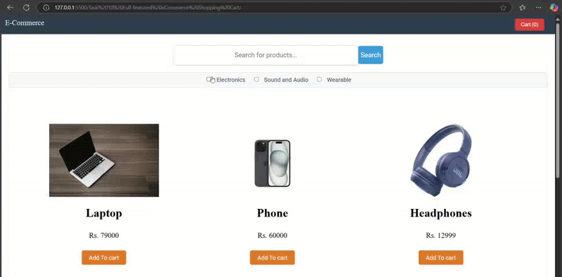

# Task 10: Full-featured eCommerce Shopping Cart

## Overview

This project involves building a comprehensive eCommerce simulation that includes product listings, a shopping cart, and dynamic price calculations.

---

## Demonstration

### Responsive Design

---

## Objective

Build a feature-rich eCommerce application that provides a seamless shopping experience.

---

## Key Outcomes

- **Dynamic Product Rendering**:  
   Products are dynamically displayed using JavaScript, allowing for seamless updates and filtering.

- **Search Functionality**:  
   Users can search for products by name, with results updating in real-time.

- **Category Filtering**:  
   Products can be filtered by categories using checkboxes for a tailored shopping experience.

- **Interactive Shopping Cart**:  
   Users can add, remove, and adjust product quantities in the cart, with real-time updates to the total price and item count.

- **Local Storage Integration**:  
   Cart data is persisted using local storage, ensuring the cart state is maintained across sessions.

- **Responsive Design**:  
   The application is designed to work seamlessly across different devices and screen sizes.

- **Toggleable Cart View**:  
   Users can easily show or hide the cart for a cleaner browsing experience.

---
