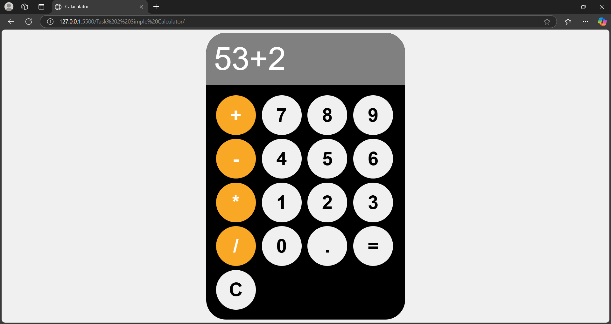

# Task 2: Simple Calculator

## Objective
Build a basic calculator that performs arithmetic operations such as:
- Addition
- Subtraction
- Multiplication
- Division

## Key Outcomes
- Utilized **JavaScript** to handle calculations effectively.
- Implemented **try-catch** blocks to handle and resolve potential errors gracefully.

