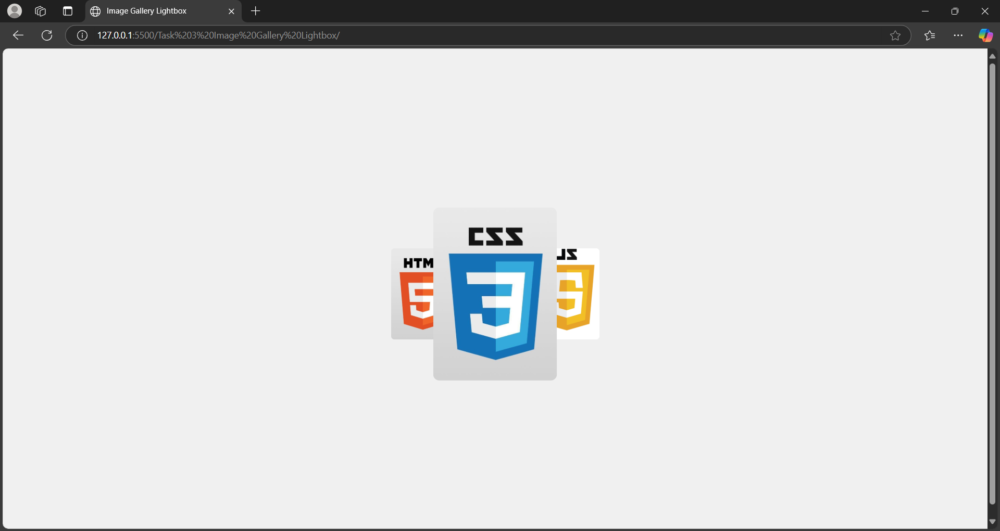
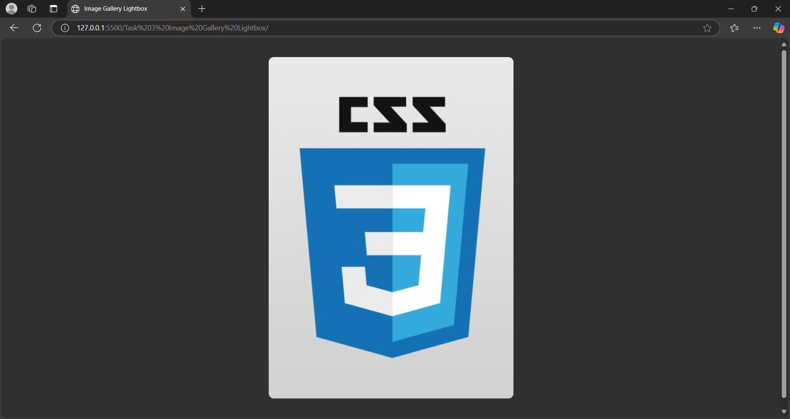

# Task 3 Image Gallery Lightbox

## Overview
This project involves creating an interactive image gallery with a lightbox feature. When a user clicks on a thumbnail image, a larger version of the image is displayed in a modal overlay.

## Objectives
- Develop an image gallery with a lightbox/modal overlay.
- Implement functionality to detect thumbnail clicks using event listeners.
- Dynamically update the modal content with the selected image.
- Utilize smooth transitions for enhanced user experience.

## Key Features
1. **Event Listeners**: Detected user interactions with thumbnail images.
2. **Dynamic Content Update**: Replaced modal content with the selected image dynamically.
3. **Smooth Transitions**: Applied CSS transitions for a polished and responsive effect.

