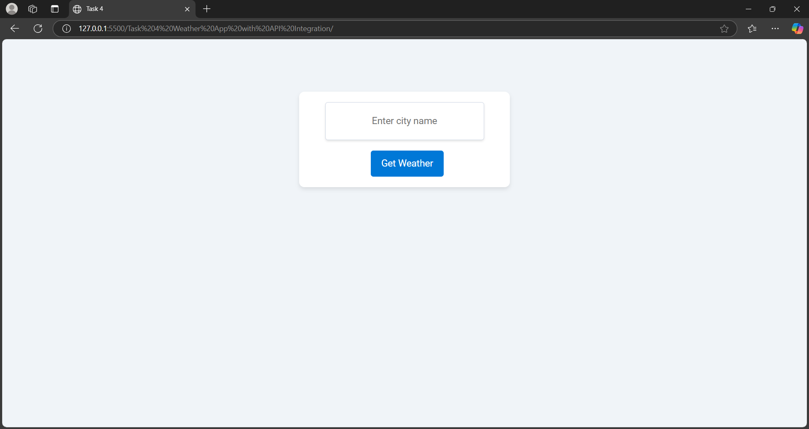
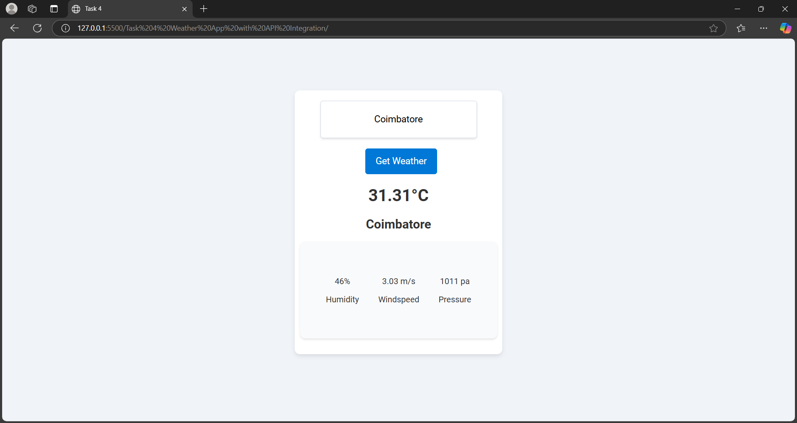

# Task 4: Weather App with API Integration

## Objective

Create a weather app that fetches and displays weather information based on a city name input.

---

## Key Outcomes

- **Fetch Data from an API**: Learn how to use the `fetch` API to retrieve data from an external source and handle responses effectively.
- **Error Handling**: Understand how to manage network errors and handle invalid user inputs gracefully.
- **Dynamic Data Display**: Gain experience in updating the webpage dynamically using DOM manipulation.
- **API Integration**: Work with the OpenWeatherMap API to fetch real-time weather data.
- **User-Friendly Interface**: Build an intuitive interface for users to input city names and view weather details.
- **Template Literals**: Explore the use of template literals to construct API URLs dynamically.
- **JavaScript Features**: Improve your understanding of modern JavaScript features like `async/await`.

---
