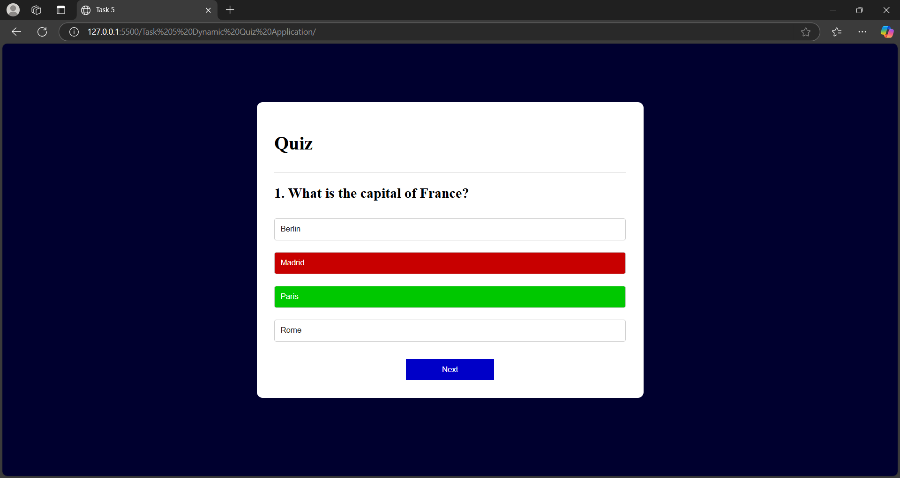

# Task 5: Dynamic Quiz Application

  

## Objective  
Build a quiz app that dynamically loads questions and tracks user scores.

## Key Outcomes  
- Dynamically load and display quiz questions.  
- Track user scores and provide feedback on correct/incorrect answers.  
- Implement a restart functionality to replay the quiz.  
- Highlight correct and incorrect answers after selection.  
- Display a final score summary at the end of the quiz.  
- Ensure a clean UI by resetting the state between questions.  
- Provide a responsive and interactive user experience.  