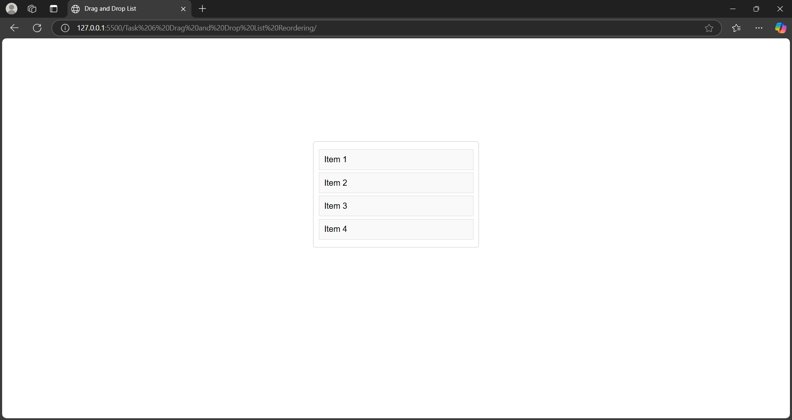

## Task 6: Drag and Drop List Reordering

  
  

### Objective  
Implement a list that allows users to reorder items using drag-and-drop functionality.

### Key Outcomes  
- **Dynamic Reordering**: Users can drag and drop list items to reorder them dynamically.  
- **Event Handling**:  
    - `dragstart` and `dragend` events handle the initiation and completion of the drag operation.  
    - `dragover` event determines the position of the dragged item relative to other list items.  
- **Position Calculation**: The `getDragAfterElement` function calculates the closest element to place the dragged item based on cursor position.  
- **Smooth User Experience**: The implementation ensures smooth and intuitive reordering of list items.  
- **JavaScript Techniques**: Demonstrates effective use of DOM manipulation and event handling in JavaScript.  
