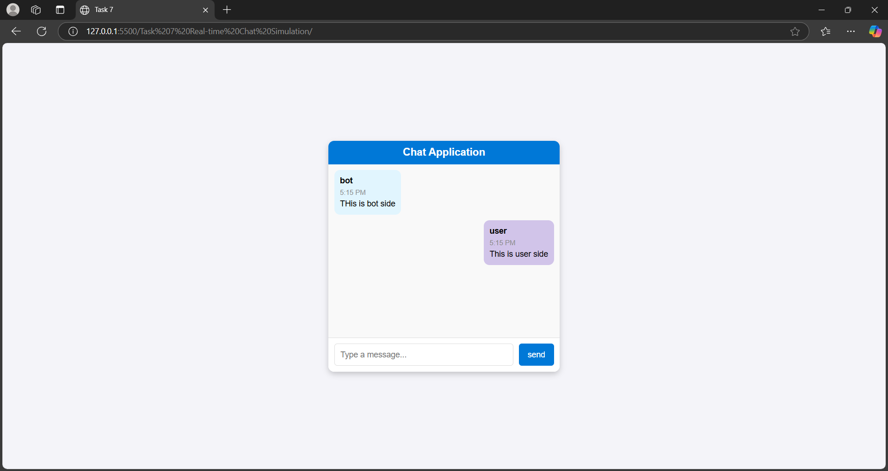
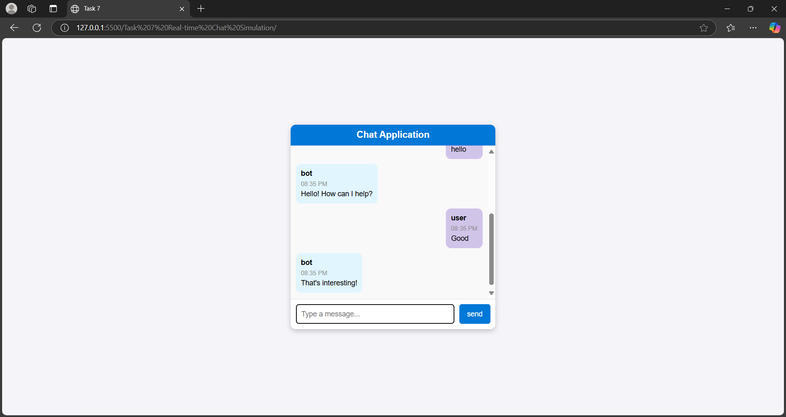

# Task 7: Real-time Chat Simulation

  

## Objective
Develop a chat interface that simulates real-time messaging without a backend.

## Key Outcomes
- **User-Friendly Interface**: Implement a chat interface with input and send button functionality.
- **Simulated Real-Time Messaging**: Introduce a delay for bot responses to mimic real-time interaction.
- **Message Display**: Show messages with timestamps and sender identification (user or bot).
- **Input Validation**: Handle empty message inputs gracefully.
- **Dynamic Interaction**: Provide a variety of bot responses to simulate engaging conversations.
- **Modular Code**: Use modular functions to enhance code readability and maintainability.
