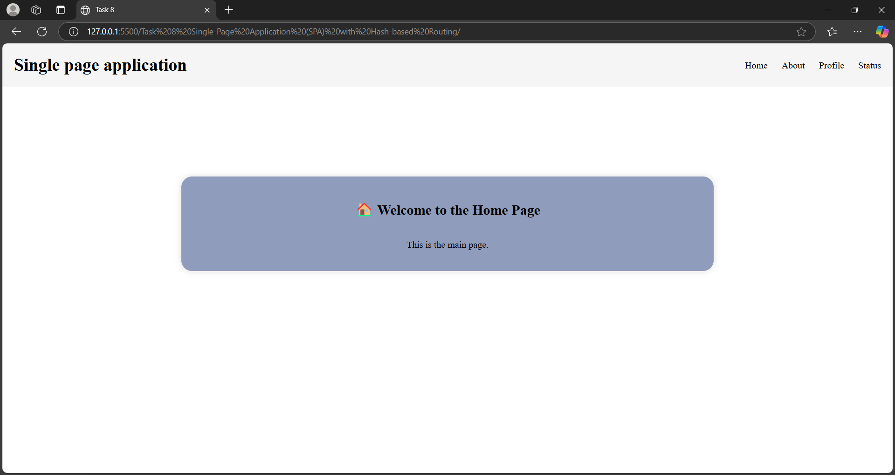
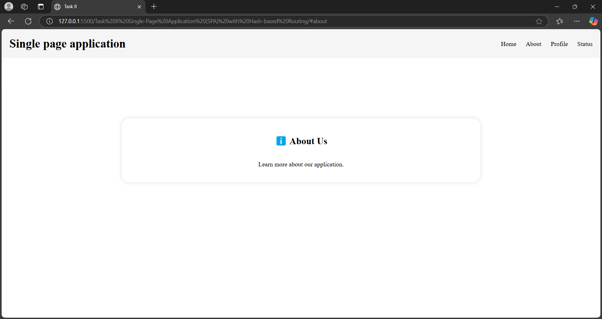

# Task 8: Single-Page Application (SPA) with Hash-based Routing

  

## Objective  
Build a basic SPA that navigates between different views without reloading the page.

## Key Outcomes  
- **Understand** the concept of Single-Page Applications (SPAs) and hash-based routing.  
- **Implement** dynamic content rendering based on URL hash changes.  
- **Create and manage** multiple views (Home, About, Profile, Status) within a single HTML page.  
- **Handle invalid routes** gracefully with a 404 error message.  
- **Use JavaScript** to manipulate the DOM and update content dynamically.  
- **Learn to listen** for `hashchange` and `load` events to trigger routing logic.  
- **Build** a functional and interactive navigation system without page reloads.  
- **Gain experience** in organizing routes and managing application state.  
- **Improve debugging skills** by logging route changes in the console.  