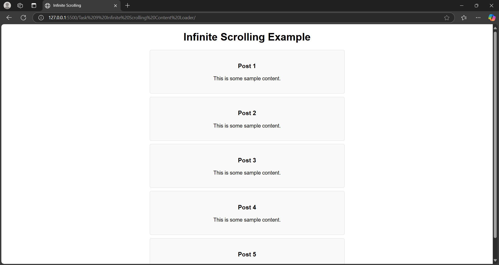

# Task 9: Infinite Scrolling Content Loader

  

## Objective
Create a web page that dynamically loads additional content as the user scrolls toward the bottom.

---

## Key Outcomes
- **Implement Infinite Scrolling**: Use JavaScript to create a seamless scrolling experience.
- **Dynamic Content Loading**: Fetch and display additional content dynamically as the user scrolls.
- **Asynchronous Functions**: Simulate content loading using asynchronous JavaScript.
- **Smooth User Experience**: Display a loader animation while fetching new content.
- **Efficient Scroll Handling**: Optimize scroll event handling to trigger content loading at the right time.
- **State Management**: Maintain the current page or state to manage content generation effectively.

---